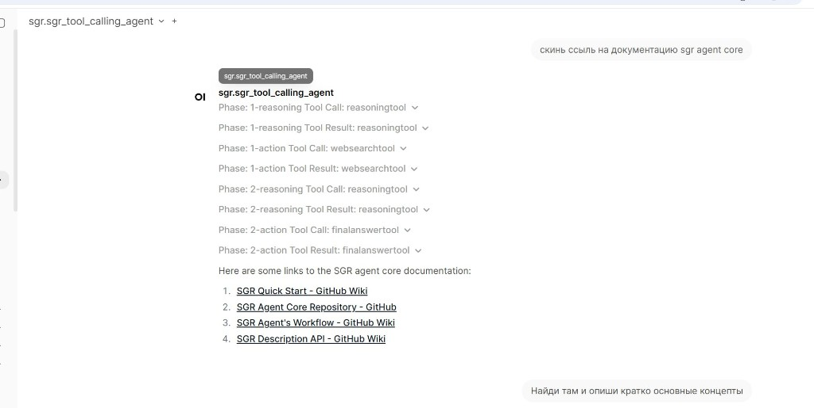

# Highlights

This page answers one simple question: **What's cool about this framework?**
Short cases and intuitive examples; for more complete and detailed docs go to:

- [Main Concepts](framework/main-concepts.md)
- [Configuration Guide](framework/configuration.md)
- [Getting Started](getting-started/index.md)

---

## 1. What is this?

SGR Agent Core is a **platform framework for building and running AI agents**, implementing our team's ideas on how to construct, study, and apply agent technologies from research to production pipelines.

The central idea is Schema-Guided Reasoning — an approach that produces deterministic, interpretable results across a wide range of LLMs, from large 70B+ models down to 7B (with caveats) or MoE 20B. We value stable, reusable per-step outputs that can be displayed, reused, and integrated into classic code systems.

**We don't aim to build a system that does everything at once.** </br>
The framework gives you enough to describe and run an agent quickly, plus a set of abstractions (`BaseAgent`, `BaseTool`, `BaseStreamingGenerator`, etc.) for deeper customization.

The `/examples` folder showcases more advanced patterns:

- **[Progressive Tool Discovery](https://github.com/vamplabai/sgr-agent-core/tree/main/examples/progressive_discovery)** — working with 50+ tools without bloating the LLM context
- **[SGR File Agent](https://github.com/vamplabai/sgr-agent-core/tree/main/examples/sgr_file_agent)** — file search by pattern/date/size, reading, grep
- **[Research with Images](https://github.com/vamplabai/sgr-agent-core/tree/main/examples/research_with_images)** — multimodal requests to an agent

More concretely:

**Mini-example: create and run an agent directly**

```python
import asyncio

from openai import AsyncOpenAI

from sgr_agent_core import AgentConfig
from sgr_agent_core.agents.sgr_agent import SGRAgent
from sgr_agent_core.tools.final_answer_tool import FinalAnswerTool


async def main() -> None:
    client = AsyncOpenAI(api_key="YOUR_OPENAI_API_KEY")

    agent = SGRAgent(
        task_messages=[
            {"role": "user", "content": "Give a brief overview of RAG systems"},
        ],
        openai_client=client,
        agent_config=AgentConfig(),
        toolkit=[FinalAnswerTool],
    )

    result = await agent.execute()
    print(result)


if __name__ == "__main__":
    asyncio.run(main())
```

The idea: you describe an agent (in code or a config file) and run it for a specific task.

---

## 2. How to use it

### You're a developer building custom agents

**-->RTFM**

- install `sgr-agent-core`;
- read the [configuration](framework/configuration.md) and [main concepts](framework/main-concepts.md) sections;
- describe agents via `config.yaml` and `agents.yaml` (or any other convenient form);
- extend base entities in code to fit your agent's logic and tools;
- call `execute()`.

**Mini-example: create an agent from configs and run it**

```python
from sgr_agent_core import GlobalConfig, AgentFactory

config = GlobalConfig.from_yaml("config.yaml")
config.definitions_from_yaml("agents.yaml")

researcher_def = config.agents["researcher"]
agent = await AgentFactory.create(
    researcher_def,
    task_messages=[{"role": "user", "content": "Find recent articles on multi-agent systems"}],
)
await agent.execute()
```

### You want to use a ready-made solution

Think of it like docker compose — **one YAML that describes what to do**:

1. Take a ready config from `/examples`, colleagues, or write your own `config.yaml`.
2. Put it in your project folder.
3. Start the server:

    ```bash
    sgr -c config.yaml
    ```

4. An API spins up — by default at `http://localhost:8010`, Swagger at `http://localhost:8010/docs`.
5. Send requests using the OpenAI chat/completions protocol.

More details — [API Server Quick Start](sgr-api/SGR-Quick-Start.md).

---

## 3. How to get output from an agent?

There are two options:

### Run, wait, get result

- create an agent;
- call `execute()`;
- get the final result.

**Mini-example: get the final result from agent context**

```python
result = await agent.execute()

print(result)

# or directly from context
print(agent._context.execution_result)
```

This is convenient when you only care about the final answer, not the process.

### Run and stream — watch it happen

- enable streaming mode;
- connect to the stream and process events as they arrive;
- build interfaces with a "live" view of the agent's work.

**Mini-example: API request with streaming enabled**

```bash
curl -X POST "http://localhost:8010/v1/chat/completions" \
  -H "Content-Type: application/json" \
  -d '{
    "model": "sgr_agent",
    "messages": [
      {"role": "user", "content": "Research the RAG systems market and give a brief conclusion"}
    ],
    "stream": true
  }'
```

The response comes as Server-Sent Events — read the stream line by line and update your UI or logs in real time.

```
data: {"id":"chatcmpl-...","object":"chat.completion.chunk","choices":[{"delta":{"content":""},"index":0}]}

data: {"id":"chatcmpl-...","object":"chat.completion.chunk","choices":[{"delta":{"tool_calls":[{"index":0,"id":"1-reasoning","type":"function","function":{"name":"reasoning_tool","arguments":""}}]},"index":0}]}

data: {"id":"chatcmpl-...","object":"chat.completion.chunk","choices":[{"delta":{"tool_calls":[{"index":0,"function":{"arguments":"{\"reasoning_steps\":[\"Need to find current data on the RAG market\"],\"plan_status\":\"In progress\"}"}}]},"index":0}]}

data: {"id":"chatcmpl-...","object":"chat.completion.chunk","choices":[{"delta":{"tool_calls":[{"index":0,"id":"1-action","type":"function","function":{"name":"web_search_tool","arguments":"{\"query\":\"RAG systems market 2025\"}"}}]},"index":0}]}

data: {"id":"chatcmpl-...","object":"chat.completion.chunk","choices":[{"delta":{"content":"The RAG systems market in 2025..."}},"index":0}]}

data: [DONE]
```

---

## 4. How to get a nice UI for your agent?

You can connect [Open WebUI](https://github.com/open-webui/open-webui): it understands OpenAI-compatible APIs out of the box. Point it at your server address — and get a full chat interface with history, agent switching, and streaming without writing a single line of frontend code.

```bash
docker run -d \
  -p 3000:8080 \
  -e OPENAI_API_BASE_URL=http://host.docker.internal:8010/v1 \
  -e OPENAI_API_KEY=dummy \
  ghcr.io/open-webui/open-webui:main
```

After startup open `http://localhost:3000` — agents from your config will appear in the models list.



> **Important:** when connecting to Open WebUI you need to switch the streaming adapter. In `config.yaml` set:
> ```yaml
> execution:
>   streaming_generator: "open_webui"  # instead of "openai" (default)
> ```

---

## 5. How to run many agents?

The framework uses a **two-level config system** based on `GlobalConfig`, `AgentDefinition`, and `ToolDefinition`. In practice:

- one base `config.yaml` with shared settings (model, limits, log/report directories);
- one or more agent definition files (`agents.yaml`, `more_agents.yaml`, etc.).
- note: both global config and agent configs can be combined into a single file if preferred.

Simplest mental model:

- keep it simple — one config, one universal agent;
- go deeper — define each agent with separate roles and tools, inheriting shared parameters from the base config.

> We find YAML-based configuration a great way to avoid boilerplate code, deep inheritance chains, excessive imports, and other organizational headaches. All core modules are designed so you can easily point to custom models and classes, add your own parameters by just appending them to the existing ones.

**Mini-example: two different agents in `agents.yaml`**

```yaml
agents:
  researcher:
    base_class: "IronAgent"
    llm:
      model: "gpt-4o"
    tools:
      - "web_search_tool"
      - "extract_page_content_tool"
      - "create_report_tool"
      - "final_answer_tool"

  planner:
    base_class: "SGRToolCallingAgent"
    llm:
      model: "gpt-4o-mini"
    tools:
      - "generate_plan_tool"
      - "adapt_plan_tool"
      - "final_answer_tool"
```

Full configuration schema and examples in [Configuration Guide](framework/configuration.md).

---

## 6. How to understand when something goes wrong?

The framework is built around **mandatory validation of every entity the agent creates**:

- at each step, objects are created against predefined schemas;
- the result is validated before moving on;
- on schema mismatch, execution fails with a clear error rather than a silent undefined response.

This means:

- you either get valid data or a clear error;
- it's visible at which step and which part of the pipeline something went wrong.

**Mini-example: catch an error and inspect agent state**

```python
from sgr_agent_core import AgentStatesEnum

try:
    await agent.execute()
except Exception as exc:
    print(f"Agent failed: {exc}")
    print("State:", agent._context.state)
    if agent._context.state in {AgentStatesEnum.ERROR, AgentStatesEnum.FAILED}:
        print("Execution result:", agent._context.execution_result)
```

When something goes wrong, it shows up as a state and exception — not as a random hallucination in the text.
**Catch exceptions, pipe them into telemetry systems, send more stable agents to deal with less stable ones.**

---

## 7. What if my model isn't smart enough for agentic tasks?

SGR methodology enables structured reasoning even when the model can't do it on its own. Our [benchmark](https://github.com/vamplabai/sgr-agent-core/tree/main/benchmark) showed `gpt-4.1-mini` with the framework hits **Accuracy = 0.861** on SimpleQA — competitive even against solutions built on much larger models.

If your model doesn't support tool calling or structured output at all — there's **`IronAgent`**: it works with raw model responses, extracts tool name and parameters itself, and retries on failure.

The exact answer for your specific model and task only comes from running your own benchmarks.

---

## 8. I have an amazing million-dollar idea but the framework doesn't support it

The framework is designed as a base for complex custom solutions.

Several extension options:

- subclass `BaseAgent`, `BaseTool`, `BaseStreamingGenerator` and add your own behavior;
- describe new agents and tools via config, reusing existing implementations;
- combine both: custom code logic + declarative YAML settings.

Registries and configuration make this transparent:

- new agents and tools are registered and become available by name;
- configuration lets you replace or extend behavior without hardcoded dependencies.

**Mini-example: custom tool and agent using it**

```python
from sgr_agent_core import BaseTool, AgentConfig, AgentDefinition, AgentFactory
from sgr_agent_core import AgentContext
from sgr_agent_core.agents.tool_calling_agent import ToolCallingAgent
from sgr_agent_core.tools import GeneratePlanTool, FinalAnswerTool


class SummarizeNotesTool(BaseTool):
    """Summarize raw notes into a short summary."""

    text: str

    async def __call__(self, context: AgentContext, config: AgentConfig) -> str:
        # Integration with your system or model would go here
        return self.text[:200]


custom_config = AgentConfig(
    tools=[GeneratePlanTool, SummarizeNotesTool, FinalAnswerTool],
)

custom_def = AgentDefinition(
    name="notes_summarizer",
    base_class=ToolCallingAgent,
    **custom_config.model_dump(),
)

agent = await AgentFactory.create(
    custom_def,
    task_messages=[
        {"role": "user", "content": "Summarize my notes into a short summary"},
    ],
)
```

You can start with simple extensions like this and grow them into a full multi-agent system with rich configuration.
*If the idea is genuinely great, write to us or the community — we'll point you in the right direction =)*
