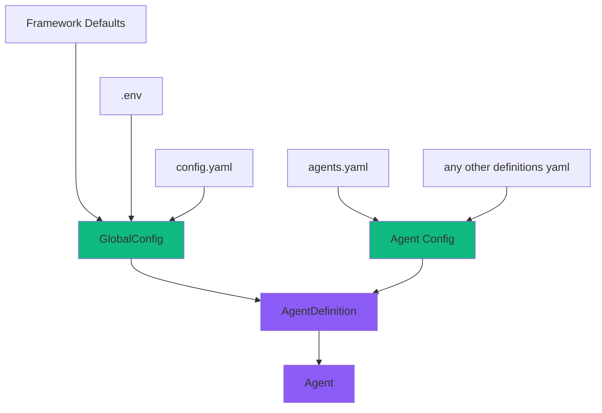

# Configuration Guide

Это руководство описывает систему конфигурации SGR Agent Core и способы настройки агентов для вашего проекта.

## Иерархия

Система конфигурации построена по принципу дополнения:
Общие настройки из основного конфига переопределяют defaults,
а специфичные из `agents` переопределяют необходимые параметры для каждого конкретного агента на уровне `AgentDefinition`.



## GlobalConfig

!!! Important "Важно: Единый инстанс GlobalConfig"
    Все вызовы `GlobalConfig()` возвращают один и тот же экземпляр. Это означает, что при создании нескольких объектов `GlobalConfig` вы получите ссылку на один и тот же объект в памяти.

    Единожды применённые изменения и загруженные конфигурации распространятся на всю программу.

### Загрузка из переменных окружения (.env)

`GlobalConfig` использует `pydantic-settings` для автоматической загрузки настроек из переменных окружения. Все переменные должны иметь префикс `SGR__` и использовать двойное подчёркивание `__` для вложенных параметров.

```python
from sgr_agent_core import GlobalConfig

config = GlobalConfig()
```
Пример можно найти в [`.env.example`](https://github.com/vamplabAI/sgr-agent-core/blob/main/.env.example).

### Загрузка из YAML файла

Для более структурированной конфигурации можно использовать YAML файлы:

```python
from sgr_agent_core import GlobalConfig

# Загрузка из config.yaml
config = GlobalConfig.from_yaml("config.yaml")
```


Пример можно найти в [`config.yaml.example`](https://github.com/vamplabAI/sgr-agent-core/blob/main/config.yaml.example).


### Переопределение параметров

**Ключевая особенность:** `AgentDefinition` наследует все параметры из `GlobalConfig` и переопределяет только те, которые указаны явно. Это позволяет создавать минималистичные конфигурации, указывая только необходимые изменения.

### Определения инструментов

Инструменты можно описывать в отдельной секции `tools:` в `config.yaml` или `agents.yaml`. Это позволяет:

- Задавать кастомные инструменты с нужными параметрами
- Ссылаться на инструменты по имени в определениях агентов
- Переопределять класс инструмента по умолчанию

**Формат определения инструмента:**

В глобальной секции `tools:` каждая запись может содержать:

- **base_class** (необязательно) — путь импорта или имя класса в реестре
- **Любые другие ключи** — передаются в инструмент при вызове как kwargs (например, `max_results`, `max_searches`, `content_limit` для поисковых инструментов). Агенты, использующие инструмент по имени, получают эти параметры; конфиг в списке `tools` агента переопределяет глобальные значения.

```yaml
tools:
  # Простое определение (base_class по умолчанию из ToolRegistry)
  reasoning_tool:
    # base_class по умолчанию: sgr_agent_core.tools.ReasoningTool

  # Кастомный инструмент с явным base_class
  custom_tool:
    base_class: "tools.CustomTool"  # Относительный путь

  # Глобальные значения по умолчанию (все агенты с этим инструментом получат эти kwargs)
  web_search_tool:
    max_results: 12
    max_searches: 6
```

**Использование инструментов в агентах:**

Каждый элемент списка `tools` может быть:

- **Строка** — имя инструмента (резолвится из секции `tools:` или `ToolRegistry`)
- **Объект** — словарь с обязательным полем `"name"` и необязательными параметрами, передаваемыми в инструмент при вызове (например, настройки поиска)

```yaml
agents:
  my_agent:
    base_class: "SGRToolCallingAgent"
    tools:
      - "web_search_tool"
      - "reasoning_tool"
      # Конфиг по инструменту: name + kwargs (например, настройки поиска)
      - name: "extract_page_content_tool"
        content_limit: 2000
      - name: "web_search_tool"
        max_results: 15
        max_searches: 6
        # tavily_api_key, max_searches и т.д. можно задать здесь вместо глобального search:
```

Настройки поиска (`tavily_api_key`, `tavily_api_base_url`, `max_results`, `content_limit`, `max_searches`) можно задавать глобально в `search:` или в объекте инструмента. kwargs инструмента переопределяют агентский `search` для этого инструмента.

!!! note "Порядок резолва инструментов"
    При резолве инструментов система проверяет в порядке:
    1. Инструменты из секции `tools:` (по имени)
    2. Инструменты из `ToolRegistry` (по имени в snake_case — рекомендуется, или по имени класса в PascalCase для совместимости)
    3. Автопреобразование snake_case → PascalCase (например, `web_search_tool` → `WebSearchTool`) для совместимости

### Примеры конфигурации агентов

Агенты определяются в файле `agents.yaml` или могут быть загружены программно:

```python
from sgr_agent_core import GlobalConfig

config = GlobalConfig.from_yaml("config.yaml")
config.definitions_from_yaml("agents.yaml")
config.definitions_from_yaml("more_agents.yaml")
```
!!!warning
    Метод `definitions_from_yaml` объединяет новые определения с существующими, перезаписывая агентов с одинаковыми именами

#### Пример 1: Минимальная конфигурация

Агент, который переопределяет только модель LLM и набор инструментов:

```yaml
agents:
  simple_agent:
    base_class: "SGRToolCallingAgent"

    # Переопределяем только модель
    llm:
      model: "gpt-4o-mini"

    # Указываем минимальный набор инструментов
    tools:
      - "web_search_tool"
      - "final_answer_tool"
```

В этом примере агент `simple_agent` использует:
- Все настройки LLM из `GlobalConfig`, кроме `model`
- Все настройки поиска из `GlobalConfig`
- Все настройки выполнения из `GlobalConfig`
- Только два указанных инструмента

#### Пример 2: Полная кастомизация

Агент с полным переопределением параметров:

```yaml
agents:
  custom_research_agent:
    base_class: "sgr_agent_core.agents.sgr_agent.ResearchSGRAgent"

    # Переопределяем LLM настройки
    llm:
      model: "gpt-4o"
      temperature: 0.3
      max_tokens: 16000
      # api_key и base_url наследуются из GlobalConfig

    # Переопределяем настройки поиска
    search:
      max_results: 15
      max_searches: 6
      content_limit: 2000

    # Переопределяем настройки выполнения
    execution:
      max_iterations: 15
      max_clarifications: 5
      max_searches: 6
      streaming_generator: "openai"  # по умолчанию; "open_webui" для Open WebUI
      logs_dir: "logs/custom_agent"
      reports_dir: "reports/custom_agent"

    # Полный набор инструментов
    tools:
      - "web_search_tool"
      - "extract_page_content_tool"
      - "create_report_tool"
      - "clarification_tool"
      - "generate_plan_tool"
      - "adapt_plan_tool"
      - "final_answer_tool"
```

#### Пример 3: Оптимизированный для скорости

Агент с настройками для быстрого выполнения:

```yaml
agents:
  fast_research_agent:
    base_class: "SGRToolCallingAgent"

    llm:
      model: "gpt-4o-mini"
      temperature: 0.1  # Более детерминированные ответы
      max_tokens: 4000  # Меньше токенов для быстрого ответа

    execution:
      max_iterations: 8  # Меньше итераций
      max_clarifications: 2
      max_searches: 3

    tools:
      - "web_search_tool"
      - "create_report_tool"
      - "final_answer_tool"
      - "reasoning_tool"
```

#### Пример 4: Streaming generator (openai / open_webui)

Формат потокового ответа задаётся через `execution.streaming_generator`. Значения берутся из `StreamingGeneratorRegistry`:

- `openai` (по умолчанию) — формат OpenAI SSE; универсальная совместимость.
- `open_webui` — формат Open WebUI с блоками `<details>` для вызовов инструментов и результатов (для UI с markdown).

```yaml
agents:
  open_webui_agent:
    base_class: "SGRToolCallingAgent"

    llm:
      model: "gpt-4o-mini"

    execution:
      streaming_generator: "open_webui"

    tools:
      - "web_search_tool"
      - "final_answer_tool"
      - "reasoning_tool"
```

Собственные генераторы регистрируются в коде; в конфиге указывается их имя из реестра.

#### Пример 5: С кастомными промптами

Агент с переопределением системных промптов:

```yaml
agents:
  technical_analyst:
    base_class: "SGRAgent"

    llm:
      model: "gpt-4o"
      temperature: 0.2

    # Переопределяем промпты
    prompts:
      system_prompt_str: |
        You are a highly specialized technical analyst.
        Your expertise includes deep technical analysis and
        detailed research documentation.

    execution:
      max_iterations: 20
      max_searches: 8

    tools:
      - "web_search_tool"
      - "extract_page_content_tool"
      - "create_report_tool"
      - "clarification_tool"
      - "final_answer_tool"
```

#### Пример 5: С определениями инструментов

Агент, использующий определения инструментов из секции `tools`:

```yaml
# Определяем инструменты в секции tools
tools:
  reasoning_tool:
    # По умолчанию: sgr_agent_core.tools.ReasoningTool
  custom_file_tool:
    base_class: "tools.CustomFileTool"  # Кастомный инструмент из локального модуля

agents:
  file_agent:
    base_class: "SGRToolCallingAgent"

    llm:
      model: "gpt-4o-mini"

    # Ссылаемся на инструменты по имени из секции tools или ToolRegistry
    tools:
      - "reasoning_tool"       # Из секции tools
      - "custom_file_tool"     # Из секции tools
      - "final_answer_tool"    # Из ToolRegistry
```

## Рекомендации

- **Храните секреты в .env** - не коммитьте чувствительные ключи в репозиторий =)

    В production окружении рекомендуется использовать ENV переменные вместо хардкода ключей в YAML

- **Используйте минимальные переопределения** - указывайте только то, что отличается от GlobalConfig
- **Храните Definitions, а не Agents** - Агенты создаются под непосредственное выполнение задачи,
их definitions можно добавлять/удалять/изменять в любое время
